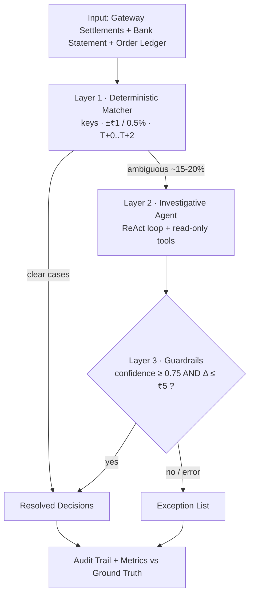
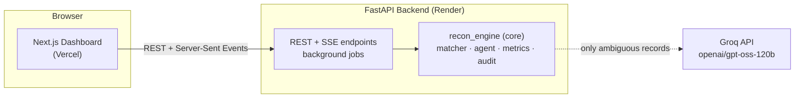

<div align="center">

# RazorRecon
### AI Finance Controller

**An AI-assisted payment-reconciliation system that combines deterministic matching, a bounded investigative AI agent, and hard financial guardrails — so every decision is automatic where it can be, investigated where it must be, and always explainable.**


-F55036)


</div>

---

## 🔗 Live Demo

| | Link |
|---|---|
| 🖥️ **Live Application (Frontend)** | **https://razor-recon-ai-finance-controller.vercel.app/** |
| 📚 **Backend API Docs (Swagger UI)** | **https://razorrecon-aifinancecontroller.onrender.com/docs** |

---

> ## ⚠️ Important — First-Time Usage (Activate the Backend First)
>
> The frontend talks to a backend hosted on **Render's free tier**, which **sleeps when it has been idle** for a while. When it is asleep, the **first request has to wake it up**, and that cold start can take a little time. Until the backend is awake, the dashboard may show *"Unreachable"* and reconciliation runs will not start.
>
> **Please follow these steps in order:**
>
> ### Step 1 — Wake the backend
> Open the API docs and wait until the page fully loads and responds:
> 👉 **https://razorrecon-aifinancecontroller.onrender.com/docs**
> (If it takes a moment on the first try, that is the service starting up — just wait for it.)
>
> ### Step 2 — Open the app
> Once the backend responds, open the frontend:
> 👉 **https://razor-recon-ai-finance-controller.vercel.app/**
> The top-right status indicator should read **"Live"** / **"Backend connected."**
>
> ### Step 3 — Use RazorRecon
> In the **About** panel, click **Generate data** once (the free backend starts with an empty dataset), then click **Run reconciliation** or **A/B: single-shot vs agent**.
>
> *In short: if the app looks disconnected, the backend is just waking up — open the API docs link, wait, then reload the app.*

---

## 📖 Table of Contents

- [The Problem](#-the-problem)
- [The Solution](#-the-solution)
- [Key Features](#-key-features)
- [How It Works](#-how-it-works)
- [Architecture](#-architecture)
- [Technology Stack](#-technology-stack)
- [Project Structure](#-project-structure)
- [Local Installation & Setup](#-local-installation--setup)
- [API Documentation](#-api-documentation)
- [Evaluation & Trust](#-evaluation--trust)
- [Deployment](#-deployment)
- [Screenshots](#-screenshots--demo)
- [Future Improvements](#-future-improvements)

---

## 🧩 The Problem

A merchant using a payment gateway ends up holding **three separate records of the same money**:

- **Gateway settlements** — what the payment processor reports it paid out (after its fees and tax).
- **Bank statement** — what actually landed in the bank account.
- **Order ledger** — what the merchant's own system says the order was worth.

In theory, all three agree. In practice, a meaningful share of them **don't**, because of:

- **Fees & tax** deducted by the gateway
- **Rounding differences**
- **Settlement delays** (money arriving a day or two later)
- **Missing bank credits**
- **Split payments** (one payout arriving as multiple bank credits)
- Duplicate references, wrong order mappings, and currency edge cases

Reconciling these mismatches by hand is **time-consuming, error-prone, and hard to scale**. And the naive fixes are unsatisfying: rigid rules break on edge cases, while an opaque "just ask an AI" approach can't be trusted with money because it offers no explanation and no bound on its authority.

---

## 💡 The Solution

RazorRecon reconciles all three sources and produces **one explainable decision per transaction** — either `MATCHED` or a specific, reasoned exception. It does this with a **three-layer design** so that AI is used *only* where it adds value, and never has the last word on money.

### Layer 1 — Deterministic Rules
Every record is first classified by transparent, auditable rules:
- Joins across the three sources on **keys** (`order_id`, `txn_id`, and the gateway reference embedded in bank narrations).
- **Amount tolerances** — a clean match is within **±₹1 or ±0.5%**.
- **Settlement date window** — a clean match lands within **T+0 to T+2**.

Clear cases are resolved instantly and cheaply. Genuinely ambiguous cases (a "gray zone" just outside these thresholds, or a messy multi-candidate situation) are *escalated* rather than guessed.

### Layer 2 — Investigative AI Agent
Only the ambiguous minority reaches the agent — a **bounded, tool-calling ReAct loop** (default model `openai/gpt-oss-120b` via Groq). It reasons in a loop and calls **read-only** tools to gather evidence before proposing a verdict:

| Tool | What it does (read-only) |
|---|---|
| `fetch_settlement` | Look up a gateway settlement row |
| `fetch_order` | Look up an order-ledger row |
| `search_bank_by_amount` | Find bank credits near a target amount |
| `widen_date_window` | Re-search bank credits over a larger date range |
| `find_split_or_merged` | Detect payments split across / merged into multiple credits |
| `list_unmatched_bank_credits` | List credits that reference no known settlement |

The agent is bounded by design: a hard **step cap (`AGENT_MAX_STEPS = 6`)**, a **shared rate limiter** so it stays within Groq's free-tier limits, and **no ability to mutate data or author amounts** — every number is re-read from source.

### Layer 3 — Guardrails
The agent's verdict is only a **recommendation**. Deterministic guardrails decide whether it counts:
- A `MATCHED` verdict is honored **only if** confidence **≥ 0.75** *(`CONFIDENCE_THRESHOLD`)* **and** the amount delta **≤ ₹5** *(`AMOUNT_DELTA_CAP`)*.
- Anything below that, or any provider error / timeout, is **escalated to the exception list** — never silently matched.

> **The AI investigates. Deterministic code keeps authority over every rupee.**

---

## ✨ Key Features

- ✅ **Automated multi-source reconciliation** across settlements, bank credits, and orders
- ✅ **Deterministic-first matching** on keys, amount tolerance, and settlement windows
- ✅ **Bounded investigative AI agent** (ReAct loop) for the ambiguous minority
- ✅ **Read-only tool use** with a captured evidence trail per decision
- ✅ **Hard guardrails** (confidence + amount-delta caps) with final authority
- ✅ **Full audit trail** — inputs seen, rule fired, agent reasoning, and final verdict for every record
- ✅ **Exception queue** — everything unresolved, each tagged with a clear reason
- ✅ **A/B evaluation** — single-shot resolver vs. investigative agent, with measured resolution lift
- ✅ **Honest metrics** vs. hidden ground truth — match rate, precision/recall, and **false-positive cost**
- ✅ **Live progress streaming** (Server-Sent Events) so long batches never block the UI
- ✅ **Graceful failure handling** — malformed rows, missing files, and LLM timeouts land in the exception list without crashing the batch
- ✅ **Offline simulation mode** — runs the full pipeline deterministically without an API key

---

## ⚙️ How It Works



Every record produces a JSON audit entry, and the whole batch is scored against a **hidden ground truth** so accuracy is measured, not assumed.

---

## 🏗️ Architecture

RazorRecon uses a **decoupled architecture**: a framework-free core engine, wrapped by a FastAPI backend, consumed by a Next.js frontend.



**Data flow:** the browser calls the backend over REST and streams progress via SSE → the backend runs the reconciliation as a background job → the **core engine** does deterministic matching, then invokes the bounded agent for ambiguous records → the agent calls Groq **only** for those cases → guardrails finalize each decision → metrics and the audit trail are returned to the UI.

- **Core engine (`core/recon_engine`)** — a standalone, importable Python library with **no web-framework imports**. It owns all reconciliation logic and is independently testable.
- **Backend (`backend/`)** — FastAPI wraps the engine, exposes REST endpoints, runs batches as background jobs, and streams progress.
- **Frontend (`frontend/`)** — a Next.js dashboard to trigger runs and inspect results.
- **LLM provider** — Groq's OpenAI-compatible endpoint, accessed via plain `requests` (no heavy SDK). Called **only** on ambiguous records.

---

## 🛠️ Technology Stack

| Layer | Technology |
|---|---|
| **Core engine** | Python 3.10+, pandas, Faker |
| **AI / LLM** | Groq API — default `openai/gpt-oss-120b`, fallback `openai/gpt-oss-20b` (OpenAI-compatible, via `requests`) |
| **Backend** | FastAPI, Uvicorn, Pydantic, python-dotenv |
| **Frontend** | Next.js 14 (App Router), React 18, TypeScript, Tailwind CSS v4, lucide-react |
| **Testing** | pytest |
| **Hosting** | Vercel (frontend) · Render (backend) |

---

## 📁 Project Structure

```
AI Finance Controller/
├── core/                          # Standalone reconciliation engine (no web framework)
│   ├── recon_engine/
│   │   ├── config.py              # All thresholds (tolerances, guardrails, model, rate cap)
│   │   ├── models.py              # Domain models + the closed set of decision statuses
│   │   ├── datagen.py             # Synthetic 3-source data generator + hidden ground truth
│   │   ├── dataio.py              # Robust CSV loading (bad rows never crash the batch)
│   │   ├── matcher.py             # Layer 1 — deterministic matching; abstains on gray zone
│   │   ├── resolver.py            # Layer 3 — bounded LLM resolver + guardrails
│   │   ├── metrics.py             # Precision/recall, false-positive cost, throughput
│   │   ├── audit.py               # Per-record audit trail
│   │   ├── pipeline.py            # Orchestrates load → match → resolve → audit → metrics
│   │   ├── llm_provider.py        # Groq provider + offline simulator (LLMProvider interface)
│   │   ├── investigability.py     # Dataset auditor + injector for A/B lift-eligible cases
│   │   └── agent/                 # Layer 2 — investigative agent
│   │       ├── investigator.py    # Bounded ReAct loop
│   │       ├── tools.py           # Read-only investigation tools
│   │       ├── model.py           # Groq tool-calling client + offline agent simulator
│   │       └── ratelimit.py       # Shared rate limiter (free-tier discipline)
│   ├── scripts/                   # run_demo, ab_compare, audit_dataset, inject_investigable
│   └── tests/                     # test_engine, test_agent, test_investigability
├── backend/
│   ├── app.py                     # FastAPI app — REST + SSE endpoints
│   ├── jobs.py                    # In-memory background job store
│   ├── requirements.txt
│   └── .env.example               # Backend env template
├── frontend/
│   ├── app/                       # Next.js App Router (layout, page, globals.css)
│   ├── lib/api.ts                 # Typed backend client
│   ├── package.json
│   └── .env.local.example         # Frontend env template
├── render.yaml                    # Render Blueprint for the backend
└── README.md
```

---

## 💻 Local Installation & Setup

### Prerequisites
- **Python 3.10+**
- **Node.js 18+**
- *(Optional)* a free **Groq API key** — without one, the app runs in offline simulation mode

### Clone the repository
```bash
git clone <your-repo-url>
cd "AI Finance Controller"
```

### Backend setup
Run from the **repository root**:
```bash
# 1. Create and activate a virtual environment
python3 -m venv .venv
source .venv/bin/activate            # Windows: .venv\Scripts\activate

# 2. Install the core engine + backend dependencies
pip install -e ./core -r backend/requirements.txt
#    (optional: enable the real LLM path + tests)
#    pip install -e "./core[llm,test]" -r backend/requirements.txt

# 3. Configure environment (see table below). The key auto-loads from backend/.env
cp backend/.env.example backend/.env   # then edit backend/.env

# 4. Start the API
uvicorn app:app --app-dir backend --host 127.0.0.1 --port 8000
```
The API is now live at `http://127.0.0.1:8000` (docs at `/docs`).

**Backend environment variables** (`backend/.env`):

| Variable | Required | Description |
|---|---|---|
| `GROQ_API_KEY` | Optional | Groq API key. If unset, ambiguous records are escalated (offline/simulation still works). |
| `GROQ_MODEL` | Optional | Default `openai/gpt-oss-120b`. |
| `GROQ_MODEL_FALLBACK` | Optional | Default `openai/gpt-oss-20b`. |
| `ALLOWED_ORIGINS` | Optional | CORS origins (your frontend URL), or `*` for dev. |
| `DATA_DIR` | Optional | Where datasets are written/read. Defaults to `backend/data`. |

> 🔒 Never commit real secrets. `backend/.env` is gitignored; only `backend/.env.example` (with blank values) is tracked.

### Frontend setup
```bash
cd frontend

# 1. Install dependencies
npm install

# 2. Point the frontend at your backend
cp .env.local.example .env.local     # sets NEXT_PUBLIC_API_URL=http://localhost:8000

# 3. Start the dev server
npm run dev
```
Open **http://localhost:3000**.

**Frontend environment variable** (`frontend/.env.local`):

| Variable | Description |
|---|---|
| `NEXT_PUBLIC_API_URL` | Base URL of the backend (e.g. `http://localhost:8000`). Read at build time. |

### Try the engine directly (no servers, no key)
```bash
pip install -e "./core[llm,test]"
pytest core/tests -q                              # run the test suite
python core/scripts/run_demo.py --regen --simulate-llm   # generate data + reconcile + print metrics
python core/scripts/ab_compare.py --regen --simulate      # single-shot vs agent A/B
```

---

## 📚 API Documentation

Interactive Swagger UI is available at **`/docs`** on the running backend:
👉 **https://razorrecon-aifinancecontroller.onrender.com/docs**

Implemented endpoints (`backend/app.py`):

| Method | Endpoint | Purpose |
|---|---|---|
| `GET` | `/` | Health + configuration summary (model, thresholds, `data_ready`) |
| `POST` | `/generate` | Create/refresh the synthetic datasets (optionally inject investigable cases) |
| `POST` | `/reconcile` | Kick off a reconciliation batch → returns a `job_id` |
| `POST` | `/compare` | Run the single-shot vs. agent A/B on the same batch |
| `GET` | `/status/{job_id}` | Poll a job's status (fallback for SSE) |
| `GET` | `/progress/{job_id}` | Live progress stream (Server-Sent Events) |
| `GET` | `/results/{job_id}` | Metrics summary + decisions + exception list |
| `GET` | `/audit/{job_id}` | Full per-record audit trail (downloadable JSON) |
| `GET` | `/data/{name}` | Download a generated CSV (e.g. `ground_truth`, `gateway_settlements`) |

---

## 🎯 Evaluation & Trust

RazorRecon is built to be **honest, not just accurate**. Every run is scored against a **hidden ground truth** that the engine never reads during reconciliation — only for measurement.

Reported metrics include:
- **Match rate** — share of records auto-resolved as `MATCHED`
- **Precision & recall** of `MATCHED` vs. true matches
- **False positives** and **false-positive cost** — matches it got *wrong*, with the money at risk called out explicitly
- **Status accuracy**, throughput, and an **exception list** of everything it could not resolve

**On the default synthetic dataset (60 records, seed 42), the engine reaches an 86.7% auto-match rate with 100% precision/recall on matches and *zero false positives*.** The A/B harness further shows the investigative agent correctly resolving cases (e.g. split settlements) that a single-shot resolver gets wrong — measured resolution lift, with no regressions.

The guiding principle:

> **A high score with one silent wrong match is worse than an honest exception list.**

That is why the system would rather **escalate a case for review than risk matching money incorrectly** — and why every decision carries a reproducible trace from raw input to final verdict.

---

## 🚀 Deployment

| Component | Platform | Notes |
|---|---|---|
| **Frontend** | **Vercel** | Next.js app; root directory `frontend`; env var `NEXT_PUBLIC_API_URL` set to the backend URL (baked in at build time). |
| **Backend** | **Render** | FastAPI service defined by `render.yaml`. Build: `pip install -e ./core -r backend/requirements.txt`. Start: `uvicorn app:app --app-dir backend --host 0.0.0.0 --port $PORT`. Secrets (`GROQ_API_KEY`, `ALLOWED_ORIGINS`) set in the dashboard. |

**Live links:**
- Frontend → https://razor-recon-ai-finance-controller.vercel.app/
- Backend API docs → https://razorrecon-aifinancecontroller.onrender.com/docs

> **Reminder:** the Render backend sleeps when idle, so **wake it first** (open the API docs link and wait for it to respond) before using the frontend. On a fresh start the backend has no data — click **Generate data** in the app's *About* panel once, then run a reconciliation. See the **First-Time Usage** callout near the top of this README.

---

## 📸 Screenshots / Demo

> _No screenshot assets are committed to the repository yet._
>
> The best way to see RazorRecon is the **live application** (wake the backend first): https://razor-recon-ai-finance-controller.vercel.app/
>
> The dashboard walks through: **Run a controlled pass → live progress → metrics → exception queue → audit trail with the agent's investigation chain → A/B comparison.**

---

## 🔮 Future Improvements

The following are **planned directions**, not currently implemented:

- Support for **additional payment gateways** and real (non-synthetic) source connectors
- **More reconciliation strategies** (e.g. many-to-many netting, fee-schedule inference)
- **Expanded agent capabilities** and a broader read-only tool set
- **Persistent storage** (database) so runs and datasets survive restarts
- **Multi-user support**, authentication, and role-based access
- **Enhanced reporting & analytics** and scheduled/automated reconciliation runs

---

<div align="center">

**RazorRecon — Make every rupee accountable.**

*AI-assisted investigation combined with deterministic control and financial guardrails.*

</div>
