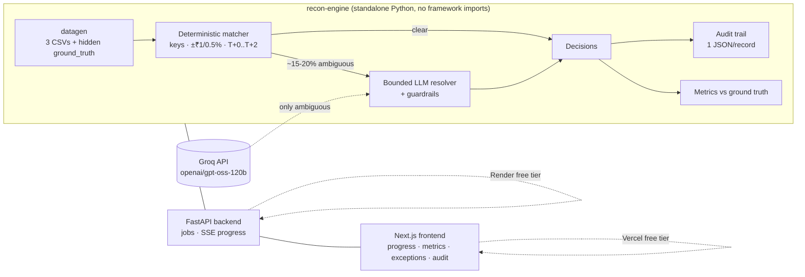

# AI Finance Controller — Autonomous Multi-Source Reconciliation

> Razorpay Buildathon · Track 04 — an autonomous agent that closes one
> finance-ops loop over a batch of 50+ records, reports its **measured** accuracy,
> and produces an **honest list of the exceptions it could not resolve**.

The loop: reconcile a merchant's **payment-gateway settlements** against their
**bank statement** and **internal order ledger**. For each transaction the engine
decides `MATCHED` or a specific exception (`MISMATCH_AMOUNT`, `MISSING_IN_BANK`,
`DUPLICATE_UTR`, `DATE_SKEW`, `CURRENCY_MISMATCH`, `SPLIT_SETTLEMENT`,
`MISSING_IN_LEDGER`, `UNRESOLVED`). **Deterministic rules run first; a bounded,
guardrailed LLM is used only for the ~15–20% genuinely ambiguous records.**

Every money-relevant decision is explainable, bounded, and logged.

## Live links

- **Frontend (Vercel):** `TODO — paste your Vercel URL`
- **Backend (Render):** `TODO — paste your Render URL` (free tier sleeps after
  ~15 min idle; the first request cold-starts in 30–60 s — **wake it before demoing**)

## Architecture (Option B — decoupled)



- **Core engine** (`core/`) — the reconciliation logic, metrics, and audit. A plain
  library with **no API/UI imports**; usable and testable on its own.
- **Backend** (`backend/`) — FastAPI wrapping the engine. Long batch runs as a
  background job with SSE progress streaming, so nothing blocks.
- **Frontend** (`frontend/`) — Next.js dashboard: trigger a run → live progress →
  metrics table → filterable exception list → audit viewer → download buttons.

## Measured results (seed 42, 60 records, 20% dirty)

Run against the hidden `ground_truth.csv`:

| | With LLM resolver | Deterministic only (no LLM) |
|---|---|---|
| Match rate | **86.7%** (52/60) | 78.3% (47/60) |
| MATCHED precision | **1.000** | 1.000 |
| MATCHED recall | **1.000** | 0.904 |
| **False positives** | **0** (₹0 at risk) | **0** (₹0 at risk) |
| Status accuracy | **1.000** | 0.917 |
| LLM calls | 5 | 0 |

The point is the **discipline, not a big headline number**: the guardrails never
produce a false positive. Without the LLM, the 5 gray-zone records are escalated
to `UNRESOLVED` (recall drops) rather than guessed. *(Numbers above use the offline
`SimulatedLLMProvider`; with a real Groq key the same ambiguous records are
resolved by `openai/gpt-oss-120b`.)*

## Quick start (all local, all free)

### 1 · Core engine + measured demo

```bash
python3 -m venv .venv && source .venv/bin/activate
pip install -e "./core[llm,test]"
pytest core/tests -q                                  # 17 tests
python core/scripts/run_demo.py --regen --simulate-llm  # generate + reconcile + report
```

`--simulate-llm` runs the full flow offline. Omit it and set `GROQ_API_KEY` to use
the real model; add `--no-llm` to see the honest deterministic-only baseline.

### 2 · Backend (FastAPI)

```bash
pip install -e ./core -r backend/requirements.txt
export GROQ_API_KEY=...        # optional; omit to escalate ambiguous cases
uvicorn app:app --app-dir backend --host 127.0.0.1 --port 8000
```

Endpoints: `POST /generate`, `POST /reconcile`, `GET /progress/{job_id}` (SSE),
`GET /status/{job_id}`, `GET /results/{job_id}`, `GET /audit/{job_id}` (download),
`GET /data/{name}.csv`. Health/config at `GET /`.

### 3 · Frontend (Next.js)

```bash
cd frontend
npm install
echo "NEXT_PUBLIC_API_URL=http://127.0.0.1:8000" > .env.local
npm run dev            # http://localhost:3000
```

In the UI: **Generate data → Run reconciliation**. Without a Groq key on the
backend, tick **“simulate LLM (offline)”** to see the full flow.

## Deploy (free)

**Backend → Render.** Push to GitHub; in Render create a **Blueprint** from the
repo (`render.yaml` is included). Or configure manually:
- Build: `pip install -e ./core -r backend/requirements.txt`
- Start: `uvicorn app:app --app-dir backend --host 0.0.0.0 --port $PORT`
- Env: `GROQ_API_KEY` (secret), `ALLOWED_ORIGINS` (your Vercel URL), `DATA_DIR=/tmp/recon_data`

**Frontend → Vercel.** Import `frontend/` as the project root; set
`NEXT_PUBLIC_API_URL` to your Render URL in project settings; deploy.

## The LLM contract & guardrails

- **Provider interface** (`core/recon_engine/llm_provider.py`): one method takes a
  structured `AmbiguousCase` → `{resolution, reason, confidence}` (strict JSON,
  temperature 0.1). It is **told, and structurally prevented from being trusted,
  to invent or alter any amount** — the resolver re-derives every number from the
  source data and ignores the model's numeric claims.
- **Config** (`core/recon_engine/config.py`): `GROQ_MODEL="openai/gpt-oss-120b"`,
  `CONFIDENCE_THRESHOLD=0.75`, `AMOUNT_DELTA_CAP=5.00`, plus all match tolerances.
- **Bounded + gated:** a `MATCHED` verdict is honoured only if
  `confidence ≥ 0.75` **and** `amount_delta ≤ ₹5`. Otherwise → exception list.
- **Groq free-tier aware:** LLM is called only on ambiguous records; calls are
  spaced to stay under 30 RPM; on 429/timeout it retries with backoff, then falls
  back to `openai/gpt-oss-20b`, then escalates the record — it never crashes.

## Investigative agent (bounded, tool-calling)

The ambiguous-record step can run in one of two modes:

- **Single-shot** — one bounded LLM classification call per ambiguous record.
- **Investigative agent** (`use_agent=True`) — a genuine **ReAct tool-calling
  agent**: the LLM drives control flow, calls **read-only** tools in a loop,
  observes results, and adapts until it can submit a verdict or hits its step
  budget. This is a real agent, deliberately bounded for finance.

What makes it finance-appropriate:
- **Read-only tools only** (`agent/tools.py`): `search_bank_by_amount`,
  `widen_date_window`, `find_split_or_merged`, `fetch_order`,
  `fetch_settlement`, `list_unmatched_bank_credits`. None mutate data, move
  money, or author amounts — the agent re-reads numbers from source.
- **Hard bounds:** `AGENT_MAX_STEPS=6` per record; on exhaustion the record is
  escalated with its **partial evidence trail**. Never loops unbounded.
- **Shared rate limiter** (`agent/ratelimit.py`), built in from the start: every
  agent Groq call passes through it, enforcing a min interval derived from
  `RPM_CAP=28` so a bursty loop stays under Groq's 30 RPM limit. The engine
  reports the **peak RPM actually observed** as proof.
- **Token discipline:** tools cap results at `MAX_TOOL_RESULTS=5` and return only
  needed fields; observations are compacted (JSON-safe) before entering context.
- **Same guardrails, final authority:** the agent's verdict is only a
  *recommendation*. The existing `confidence ≥ 0.75` / `delta ≤ ₹5` gate decides
  whether a `MATCHED` counts; otherwise → exception list.
- **Full investigation audit:** every tool call, its arguments, the observation,
  and the final verdict + guardrail outcome are logged and rendered as an
  expandable chain in the UI.

**A/B harness** (`core/scripts/ab_compare.py`, or `POST /compare`) runs both modes
on the same batch and reports the honest **resolution lift** — exceptions the
agent resolved that the single-shot version could not — plus any regressions.

```bash
python core/scripts/ab_compare.py --regen --simulate   # offline A/B, no key
```

### Investigable-exception auditor + injector

A subtlety worth being honest about: not every exception *rewards* investigation.
Deterministic exceptions (`MISSING_IN_BANK`, far `DATE_SKEW`, …) are resolved by
rules and never reach the agent, and the guardrail gates a `MATCHED` verdict on
the matcher's aggregate delta — so a `MATCHED`-type lift is blocked. The clean,
guardrail-surviving lift is a **non-match reclassification**: a messy
multi-candidate case the single-shot arm calls `MISMATCH_AMOUNT` but which the
agent's `find_split_or_merged` correctly resolves to `SPLIT_SETTLEMENT`.

- **Auditor** (`core/scripts/audit_dataset.py`) — classifies dirty records and
  reports which are *lift-eligible*: single-shot gets them wrong AND a read-only
  tool can reach the correct answer AND it survives the guardrails. Makes no LLM
  calls, never mutates data. On the base dataset it honestly reports **0** and
  says the arms will tie.
- **Injector** (`core/scripts/inject_investigable.py`, or `POST /generate` with
  `inject_investigable`) — appends realistic **split-with-decoy** cases (net paid
  across two credits, plus a third credit that erroneously shares the reference)
  with consistent ground truth. Seeded, append-only, and **idempotent**.

```bash
python core/scripts/audit_dataset.py --data data            # report only
python core/scripts/inject_investigable.py --data data      # top up to 3 cases
python core/scripts/ab_compare.py --data data --simulate    # now shows lift = 3
```

After injection the offline A/B shows the agent resolving all injected splits
(`MISMATCH_AMOUNT → SPLIT_SETTLEMENT`) that single-shot gets wrong — **lift = 3,
0 regressions, 0 false positives in both arms**.

Agent-mode metrics add: records investigated, avg steps, tool-call counts, total
Groq calls, peak RPM, and verdicts honored vs overridden by guardrails.

## Failure handling (shown, not just claimed)

- **Malformed row** → skipped, lands in the exception list as `UNRESOLVED` with a
  clear reason; the batch continues (see `test_malformed_settlement_row_becomes_exception`).
- **Missing source file** → clear `FileNotFoundError` surfaced by the API.
- **LLM timeout / 429 / bad JSON** → caught, record escalated (`source=error`/`guardrail`).
- **Agent loop can't conclude in `MAX_STEPS`** → escalated to the exception list
  with its partial evidence trail; the batch continues.

## Repository layout

```
core/
  recon_engine/        deterministic engine: config, matcher, resolver, metrics, audit, pipeline
  recon_engine/agent/  investigative agent: tools, ratelimit, model (Groq + simulator), investigator
  tests/               25 tests (engine + agent: tools, rate limiter, bounded loop, guardrails)
  scripts/             run_demo.py, ab_compare.py (single-shot vs agent A/B)
backend/      FastAPI app.py, jobs.py, requirements.txt, .env.example  (+ /compare endpoint)
frontend/     Next.js app (app/, lib/api.ts)  — agent toggle, investigation-chain viewer, A/B panel
render.yaml   Render blueprint for the backend
```

## Notes on honesty

The hidden `ground_truth.csv` is generated alongside the data and used **only for
measurement** — the engine never reads it. The false-positive list and the full
exception list are first-class outputs in both the CLI and the UI. A high match
rate with a hidden wrong match would be worse than a lower rate with an honest
exception list, and the code is built to reflect that.
